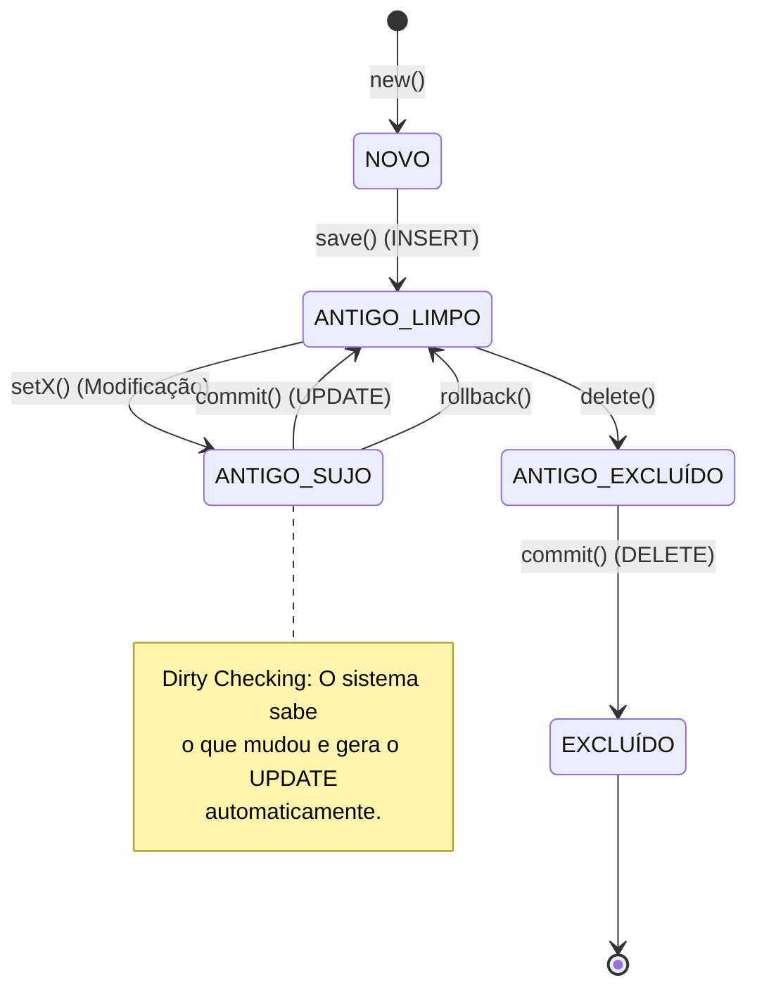

# Java ORM Framework - Advanced Design Patterns Implementation

### Beyond Theory: A Pure Java Persistence Engine
*Bridge the gap between Object-Oriented Design and Relational Data without heavy frameworks.*

---

## Sobre o Projeto

Este projeto não é apenas mais um ORM. É uma implementação de referência dos conceitos avançados de persistência discutidos por **Craig Larman** em *"Utilizando UML e Padrões"*.

O objetivo é demonstrar como construir uma arquitetura de persistência robusta, desacoplada e profissional utilizando **Java Puro**, sem depender de frameworks "mágicos" como Hibernate ou JPA. Aqui, a mágica é a **Engenharia de Software**.

### Por que este projeto é diferente?
Enquanto a maioria dos tutoriais ensina apenas a conectar no banco com JDBC, este framework implementa uma **camada de persistência completa**, resolvendo problemas complexos como:
- Impedância Objeto-Relacional.
- Gerenciamento de Estado de Objetos.
- Transações Atômicas.
- Carregamento Preguiçoso (Lazy Loading) e Mapeamento Dinâmico.

---

## Diferenciais Arquiteturais (Design Patterns)

A força deste framework reside na aplicação rigorosa dos padrões **GoF (Gang of Four)**. Cada padrão resolve um desafio crítico de persistência:

| Padrão | Problema Resolvido | Aplicação no Projeto |
| :--- | :--- | :--- |
| **Façade** | Complexidade de subsistemas | A classe `Persistencia` atua como **fachada única**, simplificando o uso do framework para o cliente final. |
| **Factory Method** | Acoplamento de criação | A `FabricaDeMapeador` cria instâncias de mapeadores (ex: `MapeadorCliente`) dinamicamente baseada em configuração, sem acoplar o código. |
| **Template Method** | Duplicação de código | Classes abstratas definem o **esqueleto do algoritmo CRUD**, permitindo que subclasses implementem apenas os detalhes específicos SQL. |
| **State** | Condicionais complexas | O ciclo de vida do objeto é gerenciado por classes de estado (`Novo`, `Sujo`, `Limpo`, `Removido`), eliminando cadeias gigantes de `if/else`. |
| **Command** | Operações atômicas | Cada operação de banco é encapsulada como um objeto `Command`, permitindo enfileiramento e execução controlada. |
| **Singleton** | Gestão de Recursos | Garante acesso global e único a componentes críticos como o `Gerenciador de Conexões` e a `Fabrica`. |
| **Identity Map** | Performance e Integridade | Cache de 1º nível que garante que cada linha do banco seja representada por **apenas uma instância** em memória por transação. |

---

## Ciclo de Vida do Objeto (State Pattern)

O framework gerencia automaticamente o estado das entidades para otimizar as operações de banco. O diagrama abaixo ilustra as transições de estado gerenciadas pelo padrão **State**:

---

## 🛠 Tecnologias Utilizadas

  
  
  
  

---

## Como Executar

### Pré-requisitos
* **Java JDK 8+**
* **PostgreSQL** instalado e rodando.
* **pgAdmin** (Opcional, para visualização).

### Configuração
1.  Clone o repositório.
2.  Importe o projeto na sua IDE favorita (Eclipse/IntelliJ/VS Code).
3.  Configure o arquivo `configuracao.xml` com as credenciais do seu banco PostgreSQL.
4.  Execute a classe `Principal` (ou a classe de teste fornecida).

